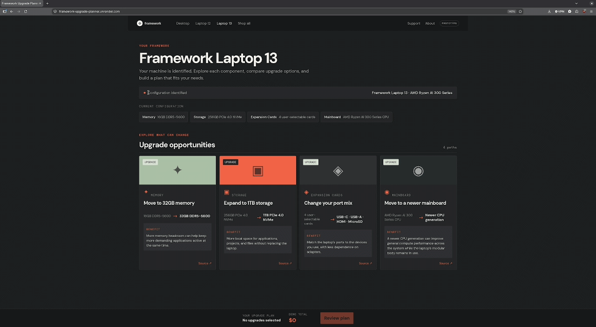

# Framework Upgrade Planner

Hi, I’m Dustin Squires, a Senior Full-stack Product Engineer who enjoys taking an ambiguous customer problem from discovery through a focused, working release. I built this small prototype because Framework’s upgradeable ownership model invites a different question from a typical laptop store: **how can an owner understand what their existing machine can become?**

**[Open the live prototype →](https://framework-upgrade-planner.onrender.com/)**

## The idea

Framework owners can replace individual components instead of replacing an entire laptop. In practice, someone who knows they need more storage or performance may still need to work out which component changes, what it does for them, and what they get to keep.

This prototype starts after a Framework Laptop 13 has been identified, which is an automatic process when you'd open this site from a Framework laptop. It gives the owner a persistent view of their machine and lets them explore four focused upgrade paths: Memory, Storage, Expansion Cards, and Mainboard.

The intent is not to choose for the owner with an opaque recommendation score. It is to make the available choices understandable and preserve their control over the decision.

## Try the flow

1. Open the identified Framework Laptop 13.
2. Click an upgrade card to explore that component in its own drawer.
3. Compare the current configuration with a proposed option before applying it.
4. See the benefit, illustrative price, and reusable components.
5. Add upgrades to a plan and review the changed configuration and total.

## What I was trying to solve

The public product experience communicates that Framework laptops can be repaired, customized, and upgraded. The product challenge I wanted to explore was the gap between that promise and an owner’s specific question: “Given the laptop I already have, what can I change and why would I choose it?”

The product hypothesis behind this work is that showing configuration-aware opportunities together, with plain-language benefits and visible reuse, makes the machine’s modularity easier to act on than sending someone through a broad catalog or a traditional checkout configurator.

The prototype deliberately keeps the scope narrow. It models one identified Laptop 13 configuration and a small, inspectable set of upgrade paths. It does not claim to represent Framework’s internal systems, roadmap, inventory, or complete cross-generation compatibility rules.

## How it is built

- **Rails 8** serves a small JSON API with direct, deterministic upgrade data.
- **React and TypeScript** provide the machine view, component drawers, local plan state, and comparison UI.
- The curated Ruby catalog makes each displayed path and reuse claim easy to inspect and test.
- The React build is served by Rails in production, keeping deployment to one Render service.

For a first slice, the data is intentionally curated rather than placed behind a broad catalog schema or recommendation engine. It made the product behavior reviewable while keeping the work focused on the user journey.

## Boundaries and questions I would validate

I would want to learn from the Framework team:

- Which questions most often precede memory, storage, or mainboard upgrades?
- How is compatibility represented across Laptop 13 generations and inventory regions?
- Where do owners get stuck when identifying their current configuration?

## About me

I have 6+ years of full-stack engineering experience and currently work as a Senior Software Engineer at Parachute Health. My strongest tools are Ruby on Rails, React/TypeScript, SQL, and systems design. I work closely with Product and Design to turn customer friction into practical, reliable software, and I take production ownership seriously through performance work, incident response, and operational debugging.

**[Read my résumé →](https://dustin-squires.github.io/resume/)**

## Contact

- Dustin Squires
- Blythewood, South Carolina
- [dustinsquires512@gmail.com](mailto:dustinsquires512@gmail.com)
- [(843) 446-3780](tel:+18434463780)
